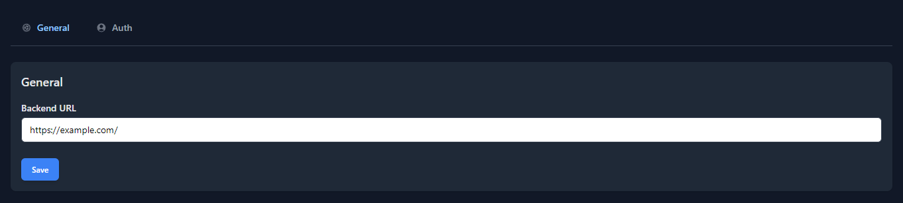
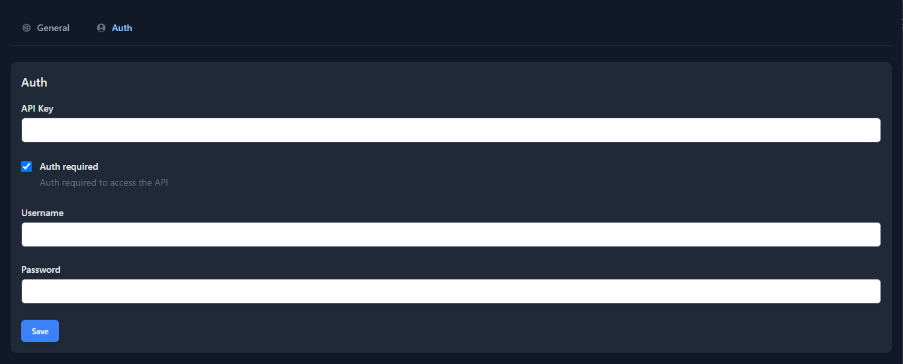
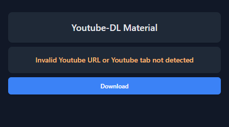
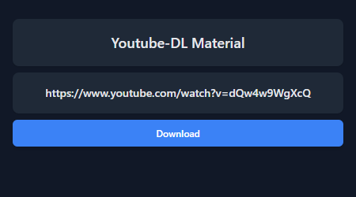
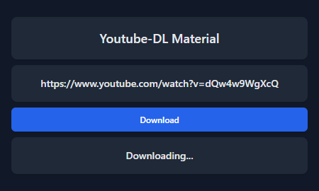
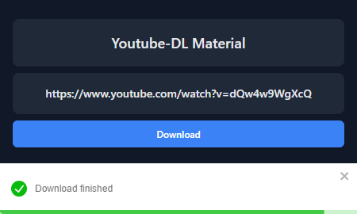

# yt-dlp-extension

This is a personal project to develop a "good" Chrome Extension for [Youtube-DL Material](https://github.com/Tzahi12345/YoutubeDL-Material), this project is not ready for any kind of enviorament. I've done my best for this piece of code, this is my first Chrome Extension, do not expect so much

# Features/Improvments

- [X] Settigns (Some times the logic stuck)
- [X] Auth with the backend (Security leaks?)
- [X] Download audio (Simple, no args)
- [X] Download in background (Work service)
- [ ] Allow video download
- [ ] Good notification system
- [ ] More download options for audio
- [ ] More download options for video
- [ ] Refactor code and improve security
- [ ] ...

## Screenshots













## Installing

1. Check if your `Node.js` version is >= **14**.
2. Change or configurate the name of your extension on `src/manifest`.
3. Run `npm install` to install the dependencies.

## Developing

run the command

```shell
$ cd <repo-name>

$ npm run dev
```

### Chrome Extension Developer Mode

1. set your Chrome browser 'Developer mode' up
2. click 'Load unpacked', and select `<repo-name>/build` folder

### Nomal FrontEnd Developer Mode

1. access `http://0.0.0.0:3000/`
2. when debugging popup page, open `http://0.0.0.0:3000//popup.html`
3. when debugging options page, open `http://0.0.0.0:3000//options.html`

## Packing

After the development of your extension run the command

```shell
$ npm run build
```

Now, the content of `build` folder will be the extension ready to be submitted to the Chrome Web Store. Just take a look at the [official guide](https://developer.chrome.com/webstore/publish) to more infos about publishing.

---

Generated by [create-chrome-ext](https://github.com/guocaoyi/create-chrome-ext)
